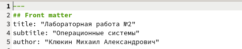
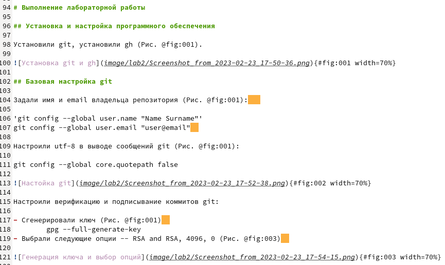
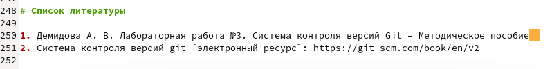

---
## Front matter
lang: ru-RU
title: Лабораторная работа №3
author:
  - Клюкин М. А.
institute:
  - Российский университет дружбы народов, Москва, Россия
  - НКАбд-02-22

## i18n babel
babel-lang: russian
babel-otherlangs: english

## Formatting pdf
toc: false
toc-title: Содержание
slide_level: 2
aspectratio: 169
section-titles: true
theme: metropolis
header-includes:
 - \metroset{progressbar=frametitle,sectionpage=progressbar,numbering=fraction}
 - '\makeatletter'
 - '\beamer@ignorenonframefalse'
 - '\makeatother'
---

## Цель

Научиться составлять отчеты с помощью языка разметки Markdown

## Задача

Сделать отчет предыдущей работы в формате Markdown

## Первый шаг

Изменили данные в соответсвии со второй лабораторной работой. Добавили личные данные

## Второй шаг

В папку image поместили картики и добавли на них ссылки в тексте документа

## Третий шаг

Добавили список используемой при выполнении работы литературы

## Выводы 

Научились пользрваться языком разметки Markdown, изучили его базовый синтаксис
