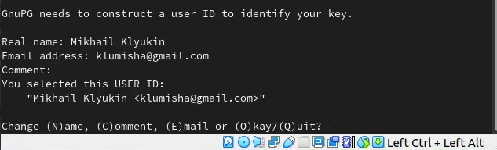

---
## Front matter
title: "Лабораторная работа №2"
subtitle: "Операционные системы"
author: "Клюкин Михаил Александрович"

## Generic otions
lang: ru-RU
toc-title: "Содержание"

## Bibliography
bibliography: bib/cite.bib
csl: pandoc/csl/gost-r-7-0-5-2008-numeric.csl

## Pdf output format
toc: true # Table of contents
toc-depth: 2
lof: true # List of figures
lot: true # List of tables
fontsize: 12pt
linestretch: 1.5
papersize: a4
documentclass: scrreprt
## I18n polyglossia
polyglossia-lang:
  name: russian
  options:
	- spelling=modern
	- babelshorthands=true
polyglossia-otherlangs:
  name: english
## I18n babel
babel-lang: russian
babel-otherlangs: english
## Fonts
mainfont: PT Serif
romanfont: PT Serif
sansfont: PT Sans
monofont: PT Mono
mainfontoptions: Ligatures=TeX
romanfontoptions: Ligatures=TeX
sansfontoptions: Ligatures=TeX,Scale=MatchLowercase
monofontoptions: Scale=MatchLowercase,Scale=0.9
## Biblatex
biblatex: true
biblio-style: "gost-numeric"
biblatexoptions:
  - parentracker=true
  - backend=biber
  - hyperref=auto
  - language=auto
  - autolang=other*
  - citestyle=gost-numeric
## Pandoc-crossref LaTeX customization
figureTitle: "Рис."
tableTitle: "Таблица"
listingTitle: "Листинг"
lofTitle: "Список иллюстраций"
lotTitle: "Список таблиц"
lolTitle: "Листинги"
## Misc options
indent: true
header-includes:
  - \usepackage{indentfirst}
  - \usepackage{float} # keep figures where there are in the text
  - \floatplacement{figure}{H} # keep figures where there are in the text
---

# Цель работы

- Изучить идеалогию и пременение средств контроля версий
- Научиться работать с git

# Задание

1. Установить программное обеспечение
2. Провести базовую настройку git
3. Создать ключ SSH
4. Создать ключи pgp
5. Провести настройку github
6. Добавить ключ PGP на Github
7. Настроить автоматическое подписываение коммитов git
8. Настроить gh
9. Создать шаблон рабочего пространства

# Теоретическое введение

Системы контроля версий используются при работе нескольких человек над одним проектом.   
Системы контроля версий хранят дерево проекта в локальном или удаленном репозитории, к которому имеют доступ все участники проекта.   
При внесении измений в проект система контроля версий позволяет фиксировать эти изменения, совмещать их, возвращаться к более ранним версиям проекта.  
Бывают распределенные и централизованные VCS. Мы будем работать с распределенной системой контроля версий -- Git. Также к распределенным системам контроля версий относятся такие VCS как Mercurial, Bazaar, Darcs.  
В распределенных системах контроля версий в локальных репозиториях пользователей хранятся полные копии всего репозитория проекта.  

# Выполнение лабораторной работы

## Установка и настройка программного обеспечения

Установили git, установили gh (Рис. @fig:001).

{#fig:001 width=70%}

## Базовая настройка git

Задали имя и email владельца репозитория (Рис. @fig:001):   

'git config --global user.name "Name Surname"'
git config --global user.email "user@email"  

Настроили utf-8 в выводе сообщений git (Рис. @fig:001):

git config --global core.quotepath false

{#fig:002 width=70%}

Настроили верификацию и подписывание коммитов git:

- Сгенерировали ключ (Рис. @fig:001)  
	gpg --full-generate-key
- Выбрали следующие опции -- RSA and RSA, 4096, 0 (Рис. @fig:003)  

{#fig:003 width=70%}

- Указали личную информацию -- имя, адрес электронной почты (Рис. @fig:004)

{#fig:004 width=70%}

- Произвели экспорт ключа и добавили его на Github (Рис. @fig:005, @fig:006)
	gpg --list-secret-keys --keyid-format LONG
	gpg --armor --export <PGP_Fingerprint>
	
{#fig:005 width=70%}

{#fig:006 width=70%}

- Произвели нвстройку автоматических подписей коммитов git (Рис. @fig:007)

{#fig:007 width=70%}

Задали имя начальной ветки, параметр autocrlf, параметр safecrlf (Рис. @fig:008)

git config -- global init.defaultBranch master  
git config -- global core.autocrlf input  
git config -- global core.safecrlf warn

{#fig:008 width=70%}

Создали ключ ssh по алгоритму rsa с размером 4096 бит, по алгоритму ed25519 (Рис. @fig:009)

{#fig:009 width=70%}

Создали учетную запись на github и провели базовую настройку профиля.

Провели настройку gh (Рис. @fig:010)

{#fig:010 width=70%}

## Настройка рабочего пространства

Создали шаблон рабочего пространства (Рис. @fig:011, @fig:012, @fig:013)

mkdir -p ~/work/study/2022-2023/"Операционные системы"  
cd ~/work/study/2022-2023/"Операционные системы"  
gh repo create study_2022-2023_os-intro --template=yamadharma/course-directory-student-template --public  
git clone --recursive 

{#fig:011 width=70%}

{#fig:012 width=70%}

{#fig:013 width=70%}

Произвели настройку каталога курса. Для этого перешли в каталог курса, удалили лишние файлы, создали необходимые каталоги, отправили файлы на сервер (Рис. @fig:014, @fig:015)

cd ~/work/study/2022-2023/"Операционные системы"/os-intro  
rm package.json  
echo os-intro > COURSE  
make  
git add .  
git commit -am 'feat(main): make course structure'   
git push  

{#fig:014 width=70%}

{#fig:015 width=70%}

# Выводы

Изучили идеалогию и научились применять системы контроля версий. Научились работать с git

# Ответы на контольные вопросы

1. Что такое системы контроля версий? Для решения каких задач они используются?   

Системы контроля версий -- это системы, записывающая изменения в файл или набор файлов втечение времени и позволяющая вернуться к определенной версии.  
VCS используются для работы нескольких человек над одним проектом.  

2. Что такое хранилище, коммит, история, рабочая копия? Как они они связаны между собой?

Хранилище -- это место, в котором хранятся и поддерживаются файлы.  
Коммит -- это сохранение изменений.   
История -- все измененения в проекте.  
Рабочая копия -- текущее состояние файлов проекта

3. Что представляют собой централизованные и распределенные системы контроля версий?

Централизованные системы имеют одно хранилище всего проекта, каждый пользователь копирует необходимые файлы, изменяет их и добавляет изменения обратно (Subversion, CVS, TFS, AccuRev).  
В распределенных системах контроля версий у каждого пользователя свой вариант репозитория. В них присутствует возвможность добавлять изменения из любого репозитория (Git, Mercurial, Bazaar).  

4. Опишите действия с VCS при единоличной работе с хранилищем.

Создаем и подключаем рабочий репозиторий. В ходе работы над проектом отправляем все изменения на сервер.  

5. Опишите порядок работы с общим хранилищем.

Получаем нужную версию фалов, вносим изменения, размещаем новую версию в хранилище. Предыдущие версии не удаляются, к ним можно всегда вернуться.

6. Каковы основные задачи, решаемые инструментальным средством git?

Хранит информацию о всех изменениях, обеспечивает комфортную командную работу над проектом.

7. Назовите и дайте краткую характеристику командам git/

- git init -- создает основное дерево репозитория
- git pull -- вытягивает обновления текущего дерева из центрального репозитория
- git push -- отправляет все произведенные изменения локального дерева в центральный репозиторий
- git status -- позволяет просмотреть список измененных файлов в текущей директории
- git diff -- позволяет посмотреть текущие изменения
- git add -- добавляет все измененные или (и) созданные каталоги (файлы)
- git rm -- удаляеи файл и (или) каталог из индекса репозитория
- git commit -- сохраняет добавленные изменения
- git checkout -- изпользуется для переключения на ветку

8. Приведите примеры использования при работе с локальным и удаленным репозиториями.

git push -all  
git push origin main  

9. Что такое и зачем нужны ветки?

Ветки -- параллельные участки истории изменений  
Ветки используются при разработке новых функций

10. Как и зачем можно игнорировать некоторые файлы?

Для того, чтобы игнорировать файлы, их названия нужно добавить в файл .gitignore.  
Некоторые файлы не требуется добавлять в репозиторий. Именно такие файлы и игнорируются.
  
# Список литературы

1. Демидова А. В. Лабораторная работа №3. Система контроля версий Git – Методическое пособие  
2. Система контроля версий git [электронный ресурс]: https://git-scm.com/book/en/v2

::: {#refs}
:::
