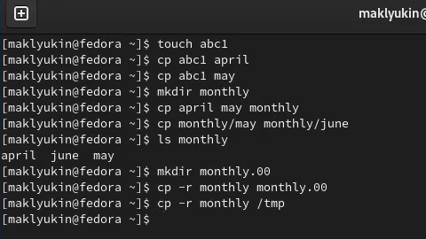
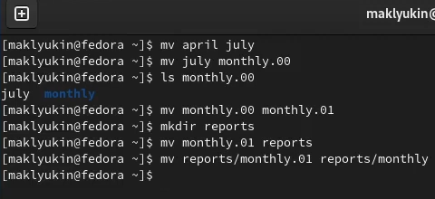
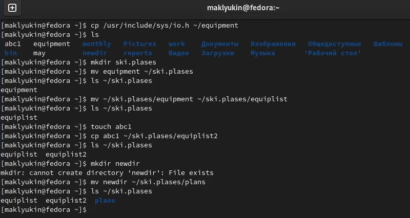
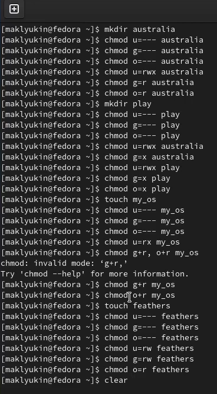

---
## Front matter
title: "Лабораторная работа №5"
subtitle: "Операционные системы"
author: "Клюкин Михаил Александрович"

## Generic otions
lang: ru-RU
toc-title: "Содержание"

## Bibliography
bibliography: bib/cite.bib
csl: pandoc/csl/gost-r-7-0-5-2008-numeric.csl

## Pdf output format
toc: true # Table of contents
toc-depth: 2
lof: true # List of figures
lot: true # List of tables
fontsize: 12pt
linestretch: 1.5
papersize: a4
documentclass: scrreprt
## I18n polyglossia
polyglossia-lang:
  name: russian
  options:
	- spelling=modern
	- babelshorthands=true
polyglossia-otherlangs:
  name: english
## I18n babel
babel-lang: russian
babel-otherlangs: english
## Fonts
mainfont: PT Serif
romanfont: PT Serif
sansfont: PT Sans
monofont: PT Mono
mainfontoptions: Ligatures=TeX
romanfontoptions: Ligatures=TeX
sansfontoptions: Ligatures=TeX,Scale=MatchLowercase
monofontoptions: Scale=MatchLowercase,Scale=0.9
## Biblatex
biblatex: true
biblio-style: "gost-numeric"
biblatexoptions:
  - parentracker=true
  - backend=biber
  - hyperref=auto
  - language=auto
  - autolang=other*
  - citestyle=gost-numeric
## Pandoc-crossref LaTeX customization
figureTitle: "Рис."
tableTitle: "Таблица"
listingTitle: "Листинг"
lofTitle: "Список иллюстраций"
lotTitle: "Список таблиц"
lolTitle: "Листинги"
## Misc options
indent: true
header-includes:
  - \usepackage{indentfirst}
  - \usepackage{float} # keep figures where there are in the text
  - \floatplacement{figure}{H} # keep figures where there are in the text
---

# Цель работы

Ознакомиться с файловой системой Linux, её структурой, именами и содержанием каталогов. Приобрести практические навыки по применению команд для работы с файлами и каталогами, по управлению процессами (и работами), по проверке использования диска и обслуживанию файловой системы.

# Задание

1. Выполнить все примеры, приведённые в первой части описания лабораторной работы.
2. Выполниьб следующие действия, зафиксировав в отчёте по лабораторной работе используемые при этом команды и результаты их выполнения:
	2.1. Скопировать файл /usr/include/sys/io.h в домашний каталог и назовите его equipment. Если файла io.h нет, то использовать любой другой файл в каталоге /usr/include/sys/ вместо него.
	2.2. В домашнем каталоге создать директорию ~/ski.plases.
	2.3. Переместить файл equipment в каталог ~/ski.plases.
	2.4. Переименовать файл ~/ski.plases/equipment в ~/ski.plases/equiplist.
	2.5. Создать в домашнем каталоге файл abc1 и скопировать его в каталог ~/ski.plases, назвать его equiplist2.
	2.6. Создать каталог с именем equipment в каталоге ~/ski.plases.
	2.7. Переместить файлы ~/ski.plases/equiplist и equiplist2 в каталог ~/ski.plases/equipment.
	2.8. Создать и переместить каталог ~/newdir в каталог ~/ski.plases и назвать его plans.
3. Определить опции команды chmod, необходимые для того, чтобы присвоить перечисленным ниже файлам выделенные права доступа, считая, что в начале таких прав нет:
	3.1. drwxr--r-- ... australia
	3.2. drwx--x--x ... play
	3.3. -r-xr--r-- ... my_os
	3.4. -rw-rw-r-- ... feathers
	При необходимости создайте нужные файлы.
4. Проделать приведённые ниже упражнения, записывая в отчёт по лабораторной работе используемые при этом команды:
	4.1. Просмотреть содержимое файла /etc/password.
	4.2. Скопировать файл ~/feathers в файл ~/file.old.
	4.3. Переместить файл ~/file.old в каталог ~/play.
	4.4. Скопировать каталог ~/play в каталог ~/fun.
	4.5. Переместить каталог ~/fun в каталог ~/play и назвать его games.
	4.6. Лишить владельца файла ~/feathers права на чтение.
	4.7. Что произойдёт, если попытаться просмотреть файл ~/feathers командой cat?
	4.8. Что произойдёт, если попытаться скопировать файл ~/feathers?
	4.9. Дайть владельцу файла ~/feathers право на чтение.
	4.10. Лишить владельца каталога ~/play права на выполнение.
	4.11. Перейти в каталог ~/play. Что произошло?
	4.12. Дать владельцу каталога ~/play право на выполнение.
5. Прочитать man по командам mount, fsck, mkfs, kill и кратко их охарактеризовать, приведя примеры.

# Теоретическое введение

Файловая система (ФС) — архитектура хранения данных, которые могут находиться в разделах жесткого диска и ОП. Выдает пользователю доступ к конфигурации ядра. Определяет, какую структуру принимают файлы в каждом из разделов, создает правила для их генерации, а также управляет файлами в соответствии с особенностями каждой конкретной ФС. Основные файловые системы, используемые в дистрибутивах Linux: Ext2; Ext3; Ext4; JFS; ReiserFS; XFS; Btrfs; ZFS. Ext2, Ext3, Ext4 или Extended Filesystem – стандартная файловая система, первоначально разработанная еще для Minix. 

# Выполнение лабораторной работы

Выполнили все примеры, приведенные в первой части описания лабораторной работы (рис. @fig:001, @fig:002, @fig:003).

{#fig:001 width=70%}

{#fig:002 width=70%}

{#fig:003 width=70%}

Скопировали файл /usr/include/sys/io.h в домашний каталог и назвали его equipment. В домашнем каталоге создади директорию ~/ski.plases. Переместили файл equipment в каталог ~/ski.plases. Переименовали файл ~/ski.plases/equipment в ~/ski.plases/equiplist. Создали в домашнем каталоге файл abc1 и скопировали его в каталог ~/ski.plases, назвали его equiplist2. Создали каталог с именем equipment в каталоге ~/ski.plases. Переместили файлы ~/ski.plases/equiplist и equiplist2 в каталог ~/ski.plases/equipment. Создали и переместили каталог ~/newdir в каталог ~/ski.plases и назвали его plans (рис. @fig:004).

{#fig:004 width=70%}

Определили опции команды chmod, необходимые для того, чтобы присвоить перечисленным ниже файлам выделенные права доступа, считая, что в начале таких прав нет (рис. @fig:005).

{#fig:005 width=70%}

drwxr--r-- ... australia  
drwx--x--x ... play  
-r-xr--r-- ... my_os  
-rw-rw-r-- ... feathers  

Просмотрели содержимое файла /etc/password. Скопировали файл ~/feathers в файл ~/file.old. Переместили файл ~/file.old в каталог ~/play. Скопировали каталог ~/play в каталог ~/fun. Переместили каталог ~/fun в каталог ~/play и назвали его games. Лишили владельца файла ~/feathers права на чтение. При попытке просмотреть файл ~/feathers командой cat произошла ошибка: permission denied. При попытке скопировать файл ~/feathers произошла ошибка: permission denied. Дали владельцу файла ~/feathers право на чтение. Лишили владельца каталога ~/play права на выполнение. Перешли в каталог ~/play. При этом произошла ошибка: permission denied. Дали владельцу каталога ~/play право на выполнение (рис. @fig:006).

{#fig:006 width=70%}

Прочитали man по командам mount, fsck, mkfs, kill и кратко их охарактеризовали, приведя примеры (рис. @fig:007).

{#fig:007 width=70%}

# Выводы

Ознакомились с файловой системой Linux, её структурой, именами и содержанием каталогов. Приобрели практические навыки по применению команд для работы с файлами и каталогами, по управлению процессами (и работами), по проверке использования диска и обслуживанию файловой системы.

# Ответы на контрольные вопросы

1. Дайте характеристику каждой файловой системе, существующей на жёстком диске компьютера, на котором вы выполняли лабораторную работу.

Ext2, Ext3, Ext4 или Extended Filesystem - это стандартная файловая система для Linux. Она была разработана еще для Minix. Она самая стабильная из всех существующих, кодовая база изменяется очень редко и эта файловая система содержит больше всего функций. Версия ext2 была разработана уже именно для Linux и получила много улучшений. В 2001 году вышла ext3, которая добавила еще больше стабильности благодаря использованию журналирования. В 2006 была выпущена версия ext4, которая используется во всех дистрибутивах Linux до сегодняшнего дня. В ней было внесено много улучшений, в том числе увеличен максимальный размер раздела до одного экзабайта.

Btrfs или B-Tree File System - это совершенно новая файловая система, которая сосредоточена на отказоустойчивости, легкости администрирования и восстановления данных. Файловая система объединяет в себе очень много новых интересных возможностей, таких как размещение на нескольких разделах, поддержка подтомов, изменение размера не лету, создание мгновенных снимков, а также высокая производительность. Но многими пользователями файловая система Btrfs считается нестабильной. Тем не менее, она уже используется как файловая система по умолчанию в OpenSUSE и SUSE Linux.

 2. Приведите общую структуру файловой системы и дайте характеристику каждой директории первого уровня этой структуры.

/ — root каталог. Содержит в себе всю иерархию системы;  

/bin — здесь находятся двоичные исполняемые файлы. Основные общие команды, хранящиеся отдельно от других программ в системе (прим.: pwd, ls, cat, ps);  

/boot — тут расположены файлы, используемые для загрузки системы (образ initrd, ядро vmlinuz);  

/dev — в данной директории располагаются файлы устройств (драйверов). С помощью этих файлов можно взаимодействовать с устройствами. К примеру, если это жесткий диск, можно подключить его к файловой системе. В файл принтера же можно написать напрямую и отправить задание на печать;  

/etc — в этой директории находятся файлы конфигураций программ. Эти файлы позволяют настраивать системы, сервисы, скрипты системных демонов;  

/home — каталог, аналогичный каталогу Users в Windows. Содержит домашние каталоги учетных записей пользователей (кроме root). При создании нового пользователя здесь создается одноименный каталог с аналогичным именем и хранит личные файлы этого пользователя;  

/lib — содержит системные библиотеки, с которыми работают программы и модули ядра;  

/lost+found — содержит файлы, восстановленные после сбоя работы системы. Система проведет проверку после сбоя и найденные файлы можно будет посмотреть в данном каталоге;  

/media — точка монтирования внешних носителей. Например, когда вы вставляете диск в дисковод, он будет автоматически смонтирован в директорию /media/cdrom;  

/mnt — точка временного монтирования. Файловые системы подключаемых устройств обычно монтируются в этот каталог для временного использования;  

/opt — тут расположены дополнительные (необязательные) приложения. Такие программы обычно не подчиняются принятой иерархии и хранят свои файлы в одном подкаталоге (бинарные, библиотеки, конфигурации);  

/proc — содержит файлы, хранящие информацию о запущенных процессах и о состоянии ядра ОС;  

/root — директория, которая содержит файлы и личные настройки суперпользователя;  

/run — содержит файлы состояния приложений. Например, PID-файлы или UNIX-сокеты;  

/sbin — аналогично /bin содержит бинарные файлы. Утилиты нужны для настройки и администрирования системы суперпользователем;  

/srv — содержит файлы сервисов, предоставляемых сервером (прим. FTP или Apache HTTP);  

/sys — содержит данные непосредственно о системе. Тут можно узнать информацию о ядре, драйверах и устройствах;  

/tmp — содержит временные файлы. Данные файлы доступны всем пользователям на чтение и запись. Стоит отметить, что данный каталог очищается при перезагрузке;  

/usr — содержит пользовательские приложения и утилиты второго уровня, используемые пользователями, а не системой. Содержимое доступно только для чтения (кроме root). Каталог имеет вторичную иерархию и похож на корневой;  

/var — содержит переменные файлы. Имеет подкаталоги, отвечающие за отдельные переменные. Например, логи будут храниться в /var/log, кэш в /var/cache, очереди заданий в /var/spool/ и так далее.  

3. Какая операция должна быть выполнена, чтобы содержимое некоторой файловой системы было доступно операционной системе?

Монтирование тома.

4. Назовите основные причины нарушения целостности файловой системы. Как устранить повреждения файловой системы?

Отсутствие синхронизации между образом файловой системы в памяти и ее данными на диске в случае аварийного останова может привести к появлению следующих ошибок:

	- Один блок адресуется несколькими mode (принадлежит нескольким файлам).

	- Блок помечен как свободный, но в то же время занят (на него ссылается onode).

	- Блок помечен как занятый, но в то же время свободен (ни один inode на него не ссылается).

	- Неправильное число ссылок в inode (недостаток или избыток ссылающихся записей в каталогах).

	- Несовпадение между размером файла и суммарным размером адресуемых inode блоков.

	- Недопустимые адресуемые блоки (например, расположенные за пределами файловой системы).

	- "Потерянные" файлы (правильные inode, на которые не ссылаются записи каталогов).

	- Недопустимые или неразмещенные номера inode в записях каталогов.

5. Как создаётся файловая система?

mkfs - позволяет создать файловую систему Linux.

6. Дайте характеристику командам для просмотра текстовых файлов.

Cat - выводит содержимое файла на стандартное устройство вывода

7. Приведите основные возможности команды cp в Linux.

Cp – копирует или перемещает директорию, файлы.

8. Приведите основные возможности команды mv в Linux.

Mv - переименовать или переместить файл или директорию

9. Что такое права доступа? Как они могут быть изменены?

Права доступа к файлу или каталогу можно изменить, воспользовавшись командой chmod. Сделать это может владелец файла (или каталога) или пользователь с правами администратора.

# Список литературы

1. Кулябов Д.С. Лабораторная работа №5. Анализ файловой системы Linux. Команды для работы с файлами и каталогами -- Методическое пособие.

::: {#refs}
:::
