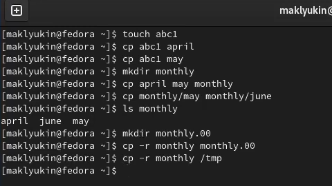
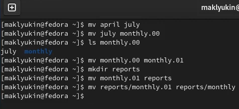
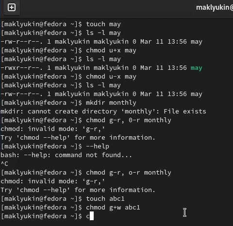
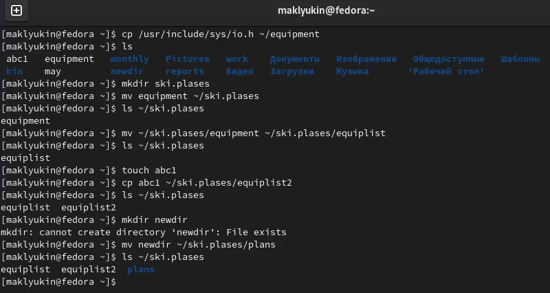
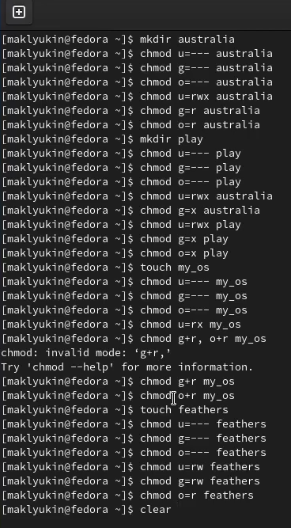
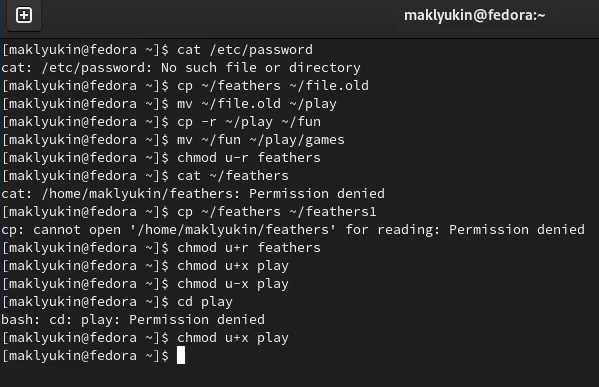
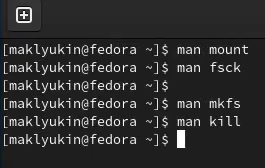

---
## Front matter
lang: ru-RU
title: Лабораторная работа №5
author:
  - Клюкин М. А.
institute:
  - Российский университет дружбы народов, Москва, Россия
  - НКАбд-02-22

## i18n babel
babel-lang: russian
babel-otherlangs: english

## Formatting pdf
toc: false
toc-title: Содержание
slide_level: 2
aspectratio: 169
section-titles: true
theme: metropolis
header-includes:
 - \metroset{progressbar=frametitle,sectionpage=progressbar,numbering=fraction}
 - '\makeatletter'
 - '\beamer@ignorenonframefalse'
 - '\makeatother'
---

## Цель

Познакомиться с файловой системой Linux, ее структурой, именами и содержанием каталогов.  
Приобрести практические навыки по применению команд для работы с файлами и каталогами.  

## Задачи

1. Выполнить все примеры из описания лабораторной
2. Выполнить приведенные команды создания, копирования, перемещения и переименования файлов и каталогов
3. Выполнить приведенные команды изменения прав доступа 
4. Прочитать мануалы по командам mount, fsck, mkfs, kill и кратко их прокомментировать

## Теоретическое введение

Файловая система (ФС) — архитектура хранения данных, которые могут находиться в разделах жесткого диска и ОП. Выдает пользователю доступ к конфигурации ядра. Определяет, какую структуру принимают файлы в каждом из разделов, создает правила для их генерации, а также управляет файлами в соответствии с особенностями каждой конкретной ФС.

# Выполнение лабораторной

## Первый шаг

Выполнили все примеры, приведенные в первой части описания лабораторной работы (рис. 1, 2, 3).

{#fig:001 width=70%}

## Первый шаг

{#fig:002 width=70%}

## Первый шаг

{#fig:003 width=70%}

## Второй шаг

Скопировали файл /usr/include/sys/io.h в домашний каталог и назвали его equipment. В домашнем каталоге создади директорию ~/ski.plases. Переместили файл equipment в каталог ~/ski.plases. Переименовали файл ~/ski.plases/equipment в ~/ski.plases/equiplist. Создали в домашнем каталоге файл abc1 и скопировали его в каталог ~/ski.plases, назвали его equiplist2. Создали каталог с именем equipment в каталоге ~/ski.plases. Переместили файлы ~/ski.plases/equiplist и equiplist2 в каталог ~/ski.plases/equipment. Создали и переместили каталог ~/newdir в каталог ~/ski.plases и назвали его plans (рис. 4).

## Второй шаг

{#fig:004 width=70%}

## Третий шаг

Определили опции команды chmod, необходимые для того, чтобы присвоить перечисленным ниже файлам выделенные права доступа, считая, что в начале таких прав нет (рис. 5).

## Третий шаг

{#fig:005 width=70%}

## Четвертый шаг

Просмотрели содержимое файла /etc/password. Скопировали файл ~/feathers в файл ~/file.old. Переместили файл ~/file.old в каталог ~/play. Скопировали каталог ~/play в каталог ~/fun. Переместили каталог ~/fun в каталог ~/play и назвали его games. Лишили владельца файла ~/feathers права на чтение. При попытке просмотреть файл ~/feathers командой cat произошла ошибка: permission denied. При попытке скопировать файл ~/feathers произошла ошибка: permission denied. Дали владельцу файла ~/feathers право на чтение. Лишили владельца каталога ~/play права на выполнение. Перешли в каталог ~/play. При этом произошла ошибка: permission denied. Дали владельцу каталога ~/play право на выполнение (рис. 6).

## Четвертый шаг

{#fig:006 width=70%}

## Пятый шаг

Прочитали man по командам mount, fsck, mkfs, kill и кратко их охарактеризовали, приведя примеры (рис. 7).

## Пятый шаг

{#fig:007 width=70%}

## Выводы 

Познакомились с файловой системой Linux, ее структурой, именами и содержанием каталогов.  
Приобрели практические навыки по применению команд для работы с файлами и каталогами.  
