---
## Front matter
title: "Лабораторная работа №4"
subtitle: "Операционные системы"
author: "Клюкин Михаил Александрович"

## Generic otions
lang: ru-RU
toc-title: "Содержание"

## Bibliography
bibliography: bib/cite.bib
csl: pandoc/csl/gost-r-7-0-5-2008-numeric.csl

## Pdf output format
toc: true # Table of contents
toc-depth: 2
lof: true # List of figures
lot: true # List of tables
fontsize: 12pt
linestretch: 1.5
papersize: a4
documentclass: scrreprt
## I18n polyglossia
polyglossia-lang:
  name: russian
  options:
	- spelling=modern
	- babelshorthands=true
polyglossia-otherlangs:
  name: english
## I18n babel
babel-lang: russian
babel-otherlangs: english
## Fonts
mainfont: PT Serif
romanfont: PT Serif
sansfont: PT Sans
monofont: PT Mono
mainfontoptions: Ligatures=TeX
romanfontoptions: Ligatures=TeX
sansfontoptions: Ligatures=TeX,Scale=MatchLowercase
monofontoptions: Scale=MatchLowercase,Scale=0.9
## Biblatex
biblatex: true
biblio-style: "gost-numeric"
biblatexoptions:
  - parentracker=true
  - backend=biber
  - hyperref=auto
  - language=auto
  - autolang=other*
  - citestyle=gost-numeric
## Pandoc-crossref LaTeX customization
figureTitle: "Рис."
tableTitle: "Таблица"
listingTitle: "Листинг"
lofTitle: "Список иллюстраций"
lotTitle: "Список таблиц"
lolTitle: "Листинги"
## Misc options
indent: true
header-includes:
  - \usepackage{indentfirst}
  - \usepackage{float} # keep figures where there are in the text
  - \floatplacement{figure}{H} # keep figures where there are in the text
---

# Цель работы

Преобрести практические навыки взаимодействия с системой посредством командной строки

# Задание

1. Определите полное имя вашего домашнего каталога. Далее относительно этого каталога будут выполняться последующие упражнения.  
2. Выполните следующие действия:   
	2.1. Перейдите в каталог /tmp.  
	2.2. Выведите на экран содержимое каталога /tmp. Для этого используйте команду ls с различными опциями. Поясните разницу в выводимой на экран информации.   
	2.3. Определите, есть ли в каталоге /var/spool подкаталог с именем cron?   
	2.4. Перейдите в Ваш домашний каталог и выведите на экран его содержимое. Определите, кто является владельцем файлов и подкаталогов?   
3. Выполните следующие действия:   
	3.1. В домашнем каталоге создайте новый каталог с именем newdir.  
	3.2. В каталоге ~/newdir создайте новый каталог с именем morefun.   
	3.3. В домашнем каталоге создайте одной командой три новых каталога с именами letters, memos, misk. Затем удалите эти каталоги одной командой.   
	3.4. Попробуйте удалить ранее созданный каталог ~/newdir командой rm. Проверьте, был ли каталог удалён.   
	3.5. Удалите каталог ~/newdir/morefun из домашнего каталога. Проверьте, был ли каталог удалён.  
4. С помощью команды man определите, какую опцию команды ls нужно использовать для просмотра содержимое не только указанного каталога, но и подкаталогов, входящих в него.   
5. С помощью команды man определите набор опций команды ls, позволяющий отсортировать по времени последнего изменения выводимый список содержимого каталога с развёрнутым описанием файлов.   
6. Используйте команду man для просмотра описания следующих команд: cd, pwd, mkdir, rmdir, rm. Поясните основные опции этих команд.   
7. Используя информацию, полученную при помощи команды history, выполните модификацию и исполнение нескольких команд из буфера команд.   

# Теоретическое введение

Командная строка -- это программа, которая позволяет управлять компьютером путем ввода текстовых команд с клавиатуры.  
Командная строка является основным интерфейсом взаимодействия пользователя с операционной системой UNIX во всех ее модификациях.  
Команды, введенные пользователем, интерпретируются и испольняются специальной программой -- командной оболочкой.

# Выполнение лабораторной работы

Определили полное имя домашнего каталога с помощью команды pwd (рис. @fig:001).

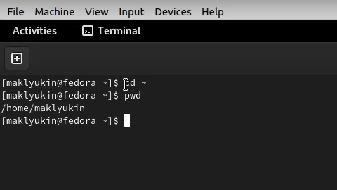{#fig:001 width=70%}

Вывели на экран содержимое каталога /tmp, используя для этого команду ls с различными опциями (рис. @fig:002):  

- опция -l выводит подробную информацию о файлах и каталогах  
- опция -a выводит содержимое каталога, включая скрытые файлы  

Определили, есть ли в каталоге /var/spool подкаталог с именем cron. Каталога с таким именем не оказалось.  
Перешли в домашний каталог и вывели на экран его содержимое  

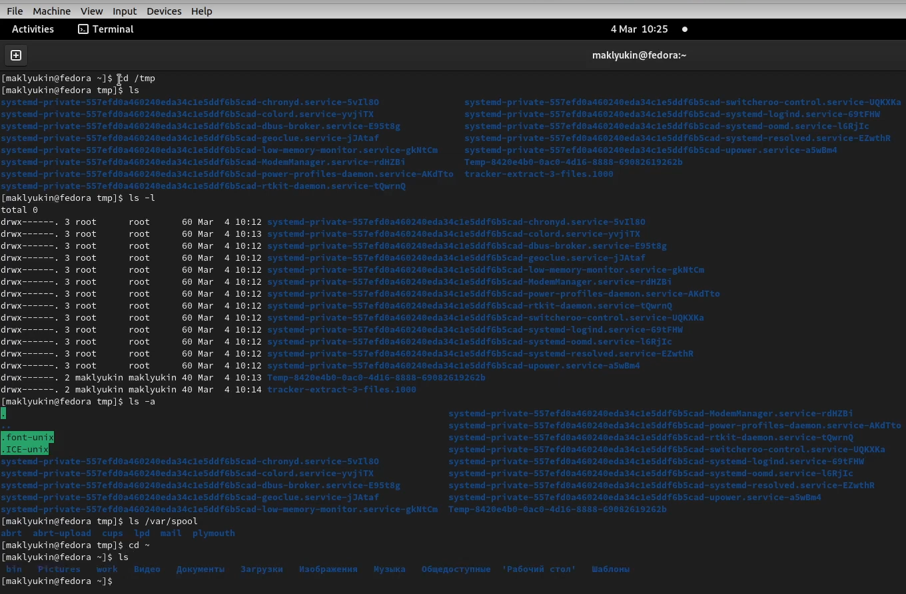{#fig:002 width=70%}

С помощью команды ls -l определили, кто является владельцем файлов и каталогов в домашнем каталоге (рис. @fig:003).  
Владельцем файлов и каталог оказался пользователь maklyukin.  

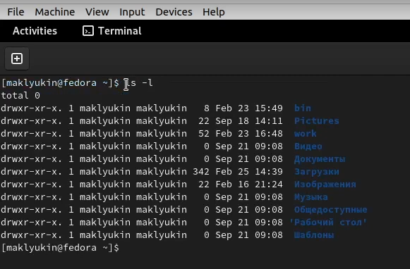{#fig:003 width=70%}

В домашнем каталоге создали новый каталог с именем newdir, в этом каталоге создали новый каталог с именем morefun.   
В домашнем каталоге одной командой создали три новых каталога с именами letters, memos, misk, а затем удалили эти каталоги одной командой.   
Удалили каталог ~/newdir командой rm. Проверили, был ли удален каталог. Вместе с каталогом ~/newdir также был удален каталог morefun (рис. @fig:004).  

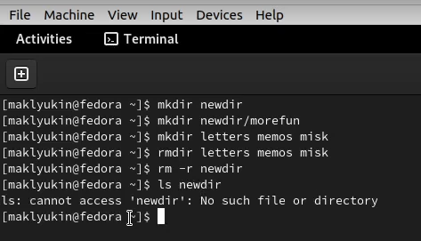{#fig:004 width=70%}

С помощью команды man определили, что опция -R команды ls используется для просмотра содержимого не только указанного каталога, но и подкаталогов, входящих в него (рис. @fig:005).  

{#fig:005 width=70%}

С помощью команды man определили, что набор опций --sort=time -l используется для сортировки выводимого списка по времени последнего изменения с развернутым описанием каталогов (рис. @fig:006).  

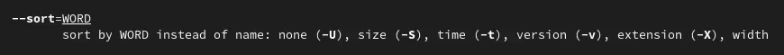{#fig:006 width=70%}

Использовали команду man для просмотра описания команд  cd (рис. @fig:007), pwd (рис. @fig:008), mkdir (рис. @fig:009), rmdir (рис. @fig:010), rm (рис. @fig:011).

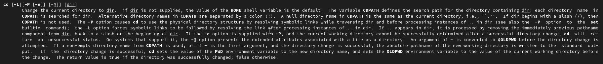{#fig:007 width=70%}

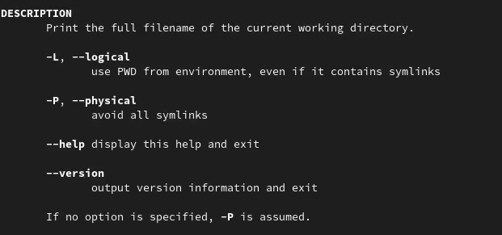{#fig:008 width=70%}

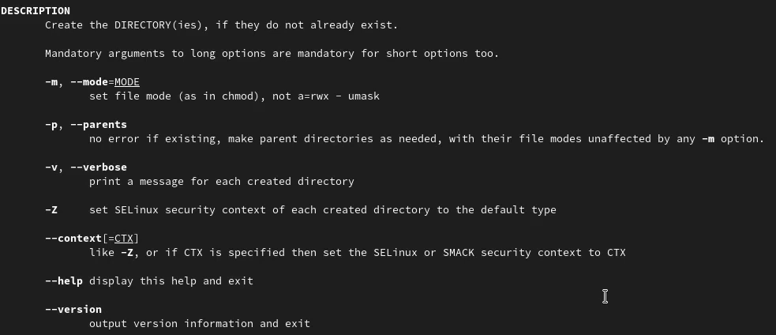{#fig:009 width=70%}

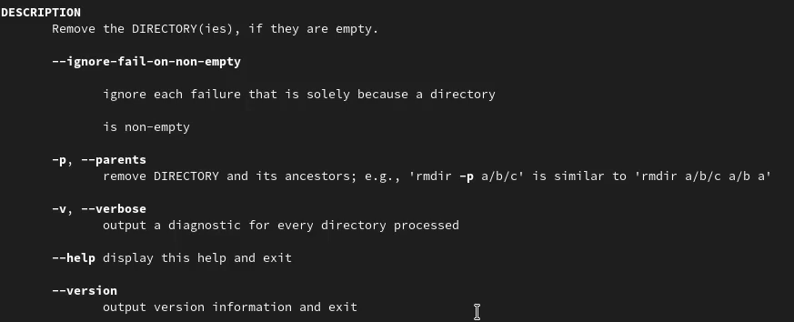{#fig:010 width=70%}

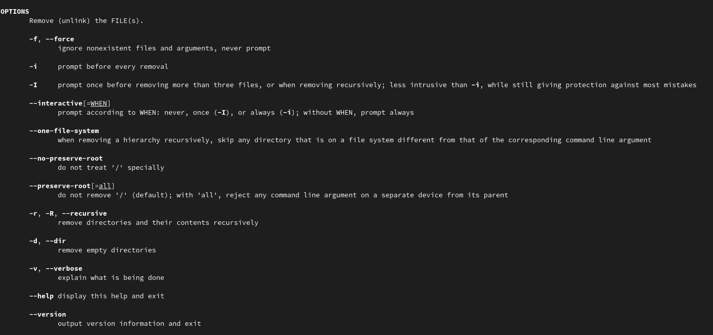{#fig:011 width=70%}

Ипользуя информацию, полученную при помощи команды history, модифицировали и исполнили несколько команд из буфера команд (рис. @fig:012, @fig:013).  

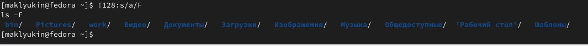{#fig:012 width=70%}

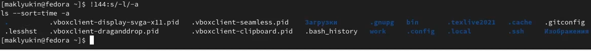{#fig:013 width=70%}

# Выводы

Преобрели практические навыки взаимодействия с системой посредством командной строки.

# Ответы на контрольные вопросы

1. Что такое командная строка?

Командная строка -- это программа, которая позволяет управлять компьютером путем ввода текстовых команд с клавиатуры

2. При помощи какой команды можно определить абсолютный путь текущего каталога?
Приведите пример.

Определить абсолютный путь текущего каталога можно с помощью команды pwd.

{ width=70%}

3. При помощи какой команды и каких опций можно определить только тип файлов
и их имена в текущем каталоге? Приведите примеры.

Это можно сделать при помощи команды ls -F.

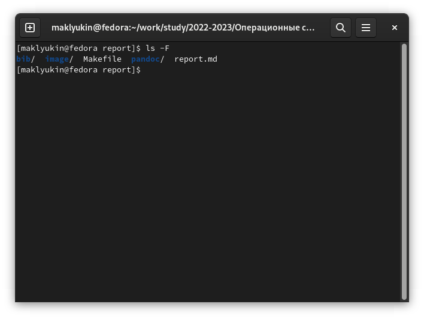{width=70%}

4. Каким образом отобразить информацию о скрытых файлах? Приведите примеры.

Информацию о скрытых файлвх можно отобразить с помощью команды ls -a.

{width=70%}

5. При помощи каких команд можно удалить файл и каталог? Можно ли это сделать
одной и той же командой? Приведите примеры.

Удаление файлов и катлогов производится при помощи команды rm.  
Опция -r позволяет удалить каталог и все его файлы и подкаталоги.  

{width=70%}

6. Каким образом можно вывести информацию о последних выполненных пользовате-
лем командах?

Это можно сделать с помощью команды history.

{width=70%}

7. Как воспользоваться историей команд для их модифицированного выполнения? При-
ведите примеры.

Для модификации команд используется следующая контсрукция: !<номер_команды>:s/<что_меняем>/<на_что_меняем>

{width=70%}

8. Приведите примеры запуска нескольких команд в одной строке.

Для запуска нескольких команд в одной строке их нужно разделить ";".

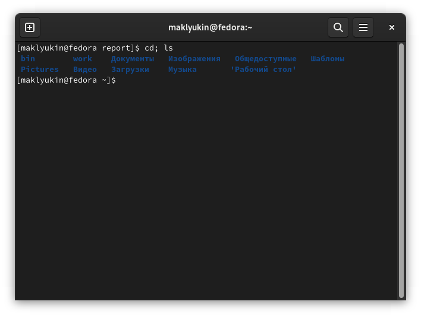{width=70%}

9. Дайте определение и приведите примера символов экранирования.

Экранирование сиволов -- замена в тексте управляющих символов  на соответсвующие текстовые подстановки. К экранирующим символам, например, относится обратный слеш "\".

10. Охарактеризуйте вывод информации на экран после выполнения команды ls с опцией l.

Команда ls с опцией  -l выводит на экран подробную информацию о файлах и каталогах: тип, права доступа, число ссылок, владелец, размер, дата последней модификации, имя файла или каталога.

11. Что такое относительный путь к файлу? Приведите примеры использования относительного и абсолютного пути при выполнении какой-либо команды.

Относительный путь к файлу -- это путь по отношению к текущему рабочему каталогу.

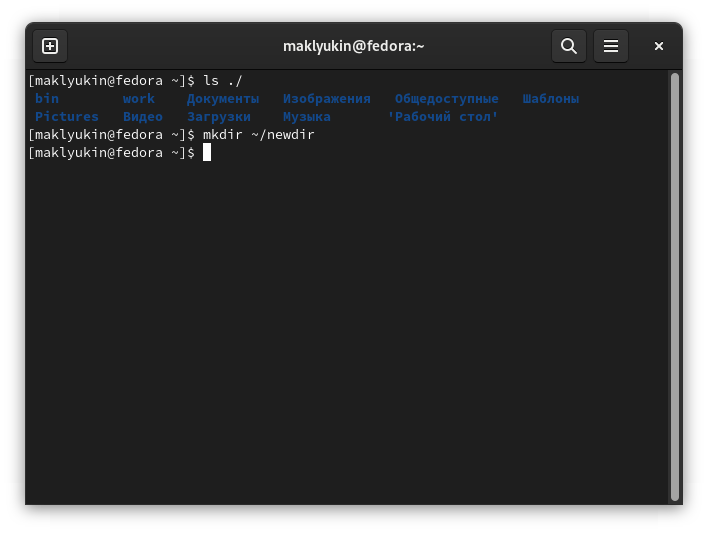{width=70%}

12. Как получить информацию об интересующей вас команде?

Информацию об интересующей команде можно получить с помощью команды man, после которой указывается имя интересующей команды, или с помощью флага --help.

13. Какая клавиша или комбинация клавиш служит для автоматического дополнения вводимых команд?

Для этого используется клавиша Tab.

# Список литературы

1. Кулябов Д.С. Лабораторная работа №4. Основы интерфейса взаимодействия пользователя с системой Unix на уровне командной строки -- Методическое пособие.

::: {#refs}
:::
