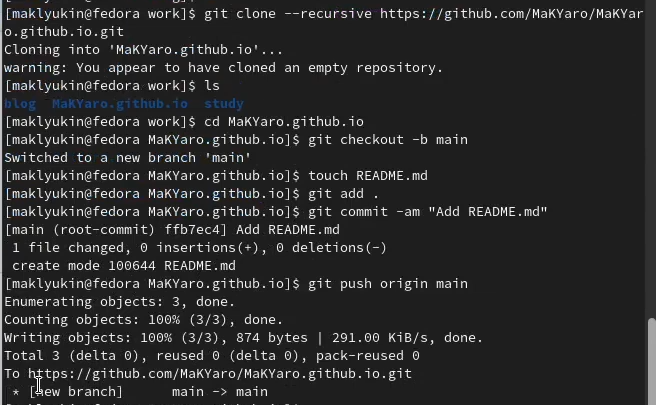
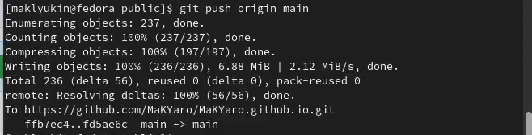

---
## Front matter
lang: ru-RU
title: Индивидуальный проект
subtitle: Часть 1
author:
  - Клюкин М. А.
institute:
  - Российский университет дружбы народов, Москва, Россия
  - НКАбд-02-22

## i18n babel
babel-lang: russian
babel-otherlangs: english

## Formatting pdf
toc: false
toc-title: Содержание
slide_level: 2
aspectratio: 169
section-titles: true
theme: metropolis
header-includes:
 - \metroset{progressbar=frametitle,sectionpage=progressbar,numbering=fraction}
 - '\makeatletter'
 - '\beamer@ignorenonframefalse'
 - '\makeatother'
---

## Цель

Создать сайт с помощью генератора статических сайтов hugo

## Задача

1. Установить необходимое программное обеспечение
2. Скачать шаблон темы сайта
3. Разместить шаблон на хостинге git
4. Установить параметры для URLs сайта
5. Разместить заготовку сайта на Github pages

# Выполнение лабораторной работы

## Скачивание архив

Скачали архив с исполняемым файлом hugo. Перенесли этот исполняемый файл в заранее созданную папку '~/bin'

## Скачивание архив

## Создание репозиторий blog

Используя репозиторий starter-hugo-academic в качестве шаблона, создали репозиторий blog, склонировали его в каталог work 

## Создание репозиторий blog

## Генерация файлов сайта

Перешли в каталог blog и запустили исполняемый файл hugo, который создал файлы для генерации сайта. Удалили каталог public 

## Генерация файлов сайта

## Запуск сервера

Запустили hugo сервер 

## Создание репозитория MaKYaro.github.io

Создали репозиторий MaKYaro.github.io, склонировали его в папку work, создали каталог MaKYaro.github.io, а в нем файл README.md. А затем отправили изменения на удаленный сервер 

## Создание репозитория MaKYaro.github.io

## Привязка репозитория к папке public

Привязали репозиторий к папке public, предварительно удалив ее из проигнорированных файлов. Запустили hugo для генерации файлов сайта 

## Отправка изменений на удаленный сервер

Отправили изменения на удаленный сервер 

## Отправка изменений на удаленный сервер

## Выводы

Создали сайт с помощью генератора статических сайтов Hugo

