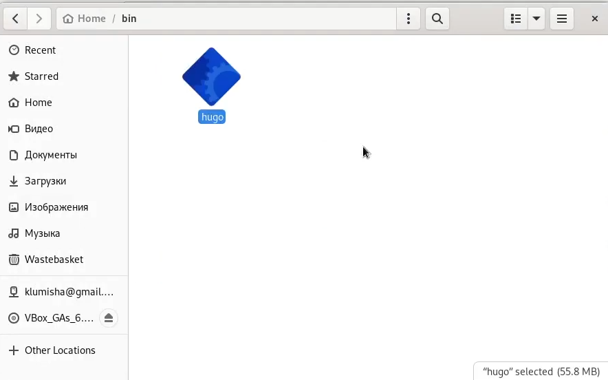
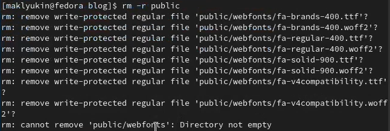

---
## Front matter
title: "Индивидуальный проект"
subtitle: "Первый этап"
author: "Клюкин Михаил Александрович"

## Generic otions
lang: ru-RU
toc-title: "Содержание"

## Bibliography
bibliography: bib/cite.bib
csl: pandoc/csl/gost-r-7-0-5-2008-numeric.csl

## Pdf output format
toc: true # Table of contents
toc-depth: 2
lof: true # List of figures
lot: true # List of tables
fontsize: 12pt
linestretch: 1.5
papersize: a4
documentclass: scrreprt
## I18n polyglossia
polyglossia-lang:
  name: russian
  options:
	- spelling=modern
	- babelshorthands=true
polyglossia-otherlangs:
  name: english
## I18n babel
babel-lang: russian
babel-otherlangs: english
## Fonts
mainfont: PT Serif
romanfont: PT Serif
sansfont: PT Sans
monofont: PT Mono
mainfontoptions: Ligatures=TeX
romanfontoptions: Ligatures=TeX
sansfontoptions: Ligatures=TeX,Scale=MatchLowercase
monofontoptions: Scale=MatchLowercase,Scale=0.9
## Biblatex
biblatex: true
biblio-style: "gost-numeric"
biblatexoptions:
  - parentracker=true
  - backend=biber
  - hyperref=auto
  - language=auto
  - autolang=other*
  - citestyle=gost-numeric
## Pandoc-crossref LaTeX customization
figureTitle: "Рис."
tableTitle: "Таблица"
listingTitle: "Листинг"
lofTitle: "Список иллюстраций"
lotTitle: "Список таблиц"
lolTitle: "Листинги"
## Misc options
indent: true
header-includes:
  - \usepackage{indentfirst}
  - \usepackage{float} # keep figures where there are in the text
  - \floatplacement{figure}{H} # keep figures where there are in the text
---

# Цель работы

Создать сайт, используя генератор статических сайтов Hugo

# Задание

1. Установить необходимое программное обеспечение
2. Скачать шаблон темы сайта
3. Разместить шаблон на хостинге git
4. Установить параметры для URLs сайта
5. Разместить заготовку сайта на Github pages

# Выполнение лабораторной работы

Скачали архив с исполняемым файлом hugo. Перенесли этот исполняемый файл в заранее созданную папку ~/bin (Рис. @fig:001, @fig:002)

{#fig:001 width=70%}

{#fig:002 width=70%}

Используя репозиторий starter-hugo-academic в качестве шаблона, создали репозиторий blog, склонировали его в каталог work (Рис. @fig:003, @fig:004).

{#fig:003 width=70%}

{#fig:004 width=70%}

Перешли в каталог blog и запустили исполняемый файл hugo, который создал файлы для генерации сайта (Рис. @fig:005). Удалили каталог public (Рис. @fig:006)

{#fig:005 width=70%}

{#fig:006 width=70%}

Запустили hugo сервер (Рис. @fig:007)

{#fig:007 width=70%}

Создали репозиторий MaKYaro.github.io, склонировали его в папку work, создали каталог MaKYaro.github.io, а в нем файл README.md. А затем отправили изменения на удаленный сервер (Рис. @fig:008, @fig:009).

{#fig:008 width=70%}

{#fig:009 width=70%}

Привязали репозиторий к папке public, предварительно удалив ее из проигнорированных файлов. Запустили hugo для генерации файлов сайта (Рис. @fig:007).

{#fig:010 width=70%}

Отправили изменения на удаленный сервер (Рис. @fig:011, @fig:012).

{#fig:011 width=70%}

{#fig:012 width=70%}

# Выводы

Создали сайт с помощью генератора статических сайтов Hugo

